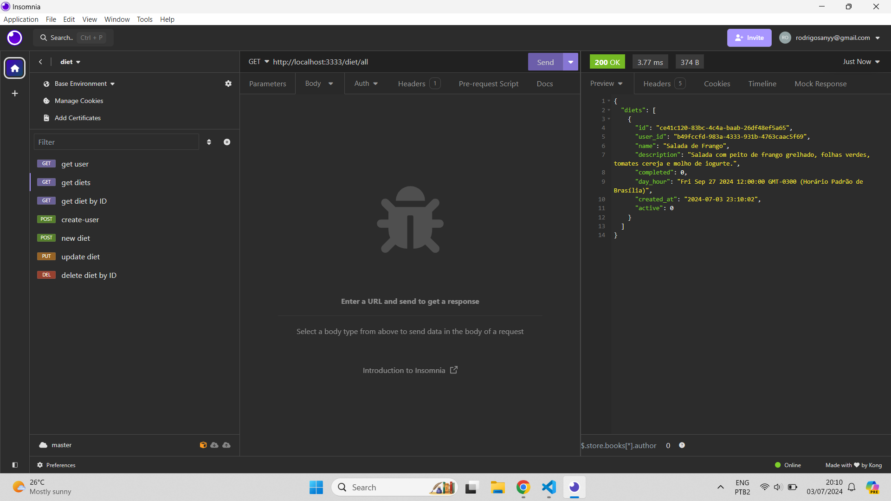

# API Daily Diet

The API Daily Diet is designed for daily diet management, allowing users to:

- Create and identify accounts.
- Record meals with details such as name, description, date, time, and diet status.
- Edit and delete meals.
- View all meals of a user or a specific meal.
- Obtain metrics such as total meals, meals within and outside the diet, and the best diet sequence.
- Access to view, edit, and delete meals is restricted to each individual user, ensuring data privacy.

## How to Download and Use

### Step 1: Clone the GitHub Repository

Copy the URL: `https://github.com/rodrrigodev/daily-diet-api.git`

Open your terminal (or command prompt) and navigate to the directory where you want to place the cloned project.

Then, execute the following command, replacing `<URL>` with the copied URL:

```bash
git clone <URL>
```

After cloning, navigate to the project directory using the cd command:
```bash
cd daily-diet-api
```
### Step 2: Installing Dependencies
Execute the command to install dependencies:

```bash
npm install
```
or
```bash
npm i
```
### Step 3: Running the API
In the terminal, execute the command npm run dev. This will start the server as configured in the dev script.
The server will be started at `http://localhost:3000`.

Note: Make sure your development environment has Node.js installed.

#### Useful Tools
To use the API endpoints after starting the server locally (as explained above), you will need a tool that allows you to send HTTP requests to test and interact with these endpoints. Two of the most popular tools for this purpose are Postman and Insomnia.

Endpoints:
- Get user metrics: `http://localhost:3333/diet/user`
- Get meal information: `http://localhost:3333/diet/all`
- Get information of a single diet: `http://localhost:3333/diet/id`
- Create a user: `http://localhost:3333/diet/create-user`
- Create a diet: `http://localhost:3333/diet/new`
- Update a diet: `http://localhost:3333/diet/id`
- Delete a diet: `http://localhost:3333/diet/id`
<br/>
These endpoints allow you to interact with the API for managing daily diets effectively.


### Some imagens:



